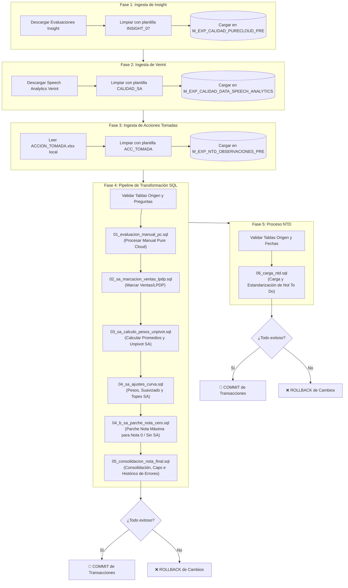

# Flujo de Ejecución - Proceso Calidad Completo

Este diagrama describe las 4 fases secuenciales que se ejecutan al presionar el botón **Iniciar Proceso de Calidad Completo** en la interfaz de Streamlit.

---

## Diagrama de Flujo (Mermaid)

---

## Detalle por Fase

### Fase 1: Ingesta de Insight (Evaluaciones Manuales)
* Descarga las evaluaciones de Insight para el periodo seleccionado.
* Limpia los datos usando la plantilla `P008-INSIGHT_07_EVALUATIONS` (eliminando acentos, estructurando tipos de datos y truncando strings).
* Vacía y carga los datos en la tabla de Teradata `DLAB_GEC.M_EXP_CALIDAD_PURECLOUD_PRE` (consolidando la entrada para las transformaciones SQL de Calidad y el proceso NTD).

### Fase 2: Ingesta de Verint (Speech Analytics)
* Descarga de forma automatizada (headless) los reportes de Speech Analytics para el periodo.
* Carga los datos por particiones usando la plantilla `P001-CALIDAD_SA`.
* Vacía e inyecta en la tabla `DLAB_GEC.M_EXP_CALIDAD_DATA_SPEECH_ANALYTICS`.

### Fase 3: Ingesta de Acciones Tomadas
* Lee el archivo local `INPUT_PROCESO_CALIDAD/ACCION_TOMADA.xlsx` (que debe colocarse antes de hacer clic en el botón).
* Limpia y estructura el dataframe según la plantilla `P004-ACC_TOMADA`.
* Vacía e inyecta en la tabla `DLAB_GEC.M_EXP_NTD_OBSERVACIONES_PRE`.

### Fase 4: Pipeline de Transformación SQL (Bajo una misma Sesión)
* **Validación inicial:** Se asegura de que ninguna tabla cargada en las fases anteriores esté vacía, y alerta si hay preguntas sin mapear en la maestra de calidad.
* **Ejecución secuencial:** Ejecuta una transacción Teradata con los scripts de consolidación.
  * **Ajuste del parche (`04_b_sa_parche_nota_cero.sql`):** Ahora aplica la lógica que actualizamos. Si el ejecutivo tiene evaluación manual en la Fase 1, pero no aparece en los reportes de Speech Analytics en la Fase 2, se le inyecta la nota máxima para el producto correspondiente a su sub-equipo, evitando que aparezca vacío en los reportes de Power BI.
* **Control de transacciones:** Si cualquier script falla, se realiza un rollback automático de toda la Fase 4 para evitar inconsistencia de datos. Si tiene éxito, se guardan los cambios (`commit`).

### Fase 5: Proceso NTD (Not To Do)
* **Validación inicial:** Se asegura de que las tablas `M_EXP_CALIDAD_PURECLOUD_PRE` y `M_EXP_NTD_OBSERVACIONES_PRE` contengan registros y que el período máximo de Insight coincida con el parametrizado en la aplicación.
* **Ejecución del pipeline:** Ejecuta de forma transaccional el script `06_carga_ntd.sql` para calcular casuísticas, homologar niveles cruzando con la maestra de NTD, registrar observaciones y calcular de forma unificada las acciones recomendadas y tomadas.
* **Control de transacciones:** Si ocurre algún error en las sentencias SQL, realiza un rollback completo para garantizar la consistencia en las tablas del reporte histórico de NTD.

