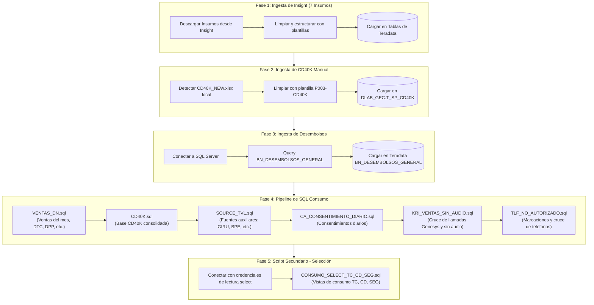

# Flujo de Ejecución - Proceso Insumos Consumo Completo

Este diagrama describe las fases secuenciales que se ejecutan al iniciar el proceso de **Carga e Ingesta de Insumos / Consumo** en la interfaz de Streamlit.

---

## Diagrama de Flujo (Mermaid)

---

## Detalle por Fase

### Fase 1: Ingesta de Insumos desde Insight
* Descarga automatizada y en paralelo de 7 insumos clave para el periodo:
  * `TRAFICO_GENESYS` -> `DLAB_GEC.M_EXP_TRAFICO_GENESIS`
  * `CONV_ATTRIBUTES` -> `DLAB_GEC.M_EXP_BT_CONVERSATIONS_ATTRIBUTES`
  * `DERIVA_BT` -> `DLAB_GEC.M_EXP_DERIVA_BT_TIEMPOS`
  * `CLOUD_MARCA_TRANSF` -> `DLAB_GEC.M_EXP_CO_CLOUD_MARCA_TRASNFERENCIA_PRE`
  * `BT_TRANSFERENCIA` -> `DLAB_GEC.M_DERIVA_BT_EV_TRANSFERENCIA`
  * `IVR_VENTAS` -> `DLAB_GEC.M_EXP_IVR_VENTAS_2022`
  * `EVALUATIONS` -> `DLAB_GEC.M_EXP_CALIDAD_PURECLOUD_PRE`
* Se aplican limpiezas de strings, normalización NFKD (sin acentos ni caracteres especiales) y truncado inteligente a 3,000 caracteres.

### Fase 2: Ingesta de CD40K Manual
* Detecta si existe un archivo local `INPUT_BASE_CONSUMO/CD40K_NEW.xlsx`.
* Si existe, **ejecuta una actualización automática desde SharePoint** (vía automatización COM por subproceso de Excel con timeout de 25s) para refrescar conexiones antes de ser procesado.
* Posteriormente, lo lee usando Polars, lo mapea usando la plantilla `P003-CD40K`, lo limpia e inyecta en la tabla Teradata `DLAB_GEC.T_SP_CD40K`.

### Fase 3: Ingesta de Desembolsos desde SQL Server
* **Extracción Automatizada:** Si las credenciales en el `.env` están configuradas y no usan los placeholders por defecto, Python se conecta vía `pyodbc` al SQL Server corporativo.
* Ejecuta un `SELECT * FROM BN_DESEMBOLSOS_GENERAL` filtrando registros donde `periodo >= {periodo_num}`.
* **Carga en Teradata:** Los datos se limpian (eliminando acentos y caracteres especiales) y se cargan mediante un `Delete + Load` en la tabla intermedia de Teradata `DLAB_GEC.BN_DESEMBOLSOS_GENERAL`, quedando disponibles antes de ejecutar el pipeline SQL de consumo.

### Fase 4: Pipeline de Transformación SQL (Bajo una misma Sesión)
* Se ejecutan los scripts SQL optimizados de consumo en el orden de dependencia correcto.
* **Habilitación de Autocommit:** Al inicio de la fase, se configura a nivel de conexión `autocommit = True` en Python. Esto evita el error Teradata **3932 (Only an ET or null statement is legal after a DDL Statement)**, permitiendo que DDL mixtos (como `CREATE MULTISET TABLE` y `DROP TABLE` en `KRI_VENTAS_SIN_AUDIO.sql` o `COLLECT STATISTICS` en varios archivos) se ejecuten sin bloquear la sesión.

### Fase 5: Script Secundario con Conexión Separada
* Abre una nueva conexión con el usuario secundario (configurado mediante `TERADATA_USER_SELECT` en el `.env`) para tener los privilegios adecuados de lectura/escritura selectiva.
* Ejecuta `CONSUMO_SELECT_TC_CD_SEG.sql` para:
  1. Generar y consolidar las vistas del negocio de Tarjeta de Crédito (TC), Cuenta de Ahorros/Débito (CD) y Seguros (SEG) en `M_EXP_CONSUMO_SELECT_TC_CD_SEG`.
  2. Reemplazar y parametrizar la vista de consumo `DLAB_GEC.V_GESTION_CHIP` con el período de ejecución actual.
* Habilita `autocommit = True` en la conexión secundaria para garantizar una ejecución DDL limpia.
